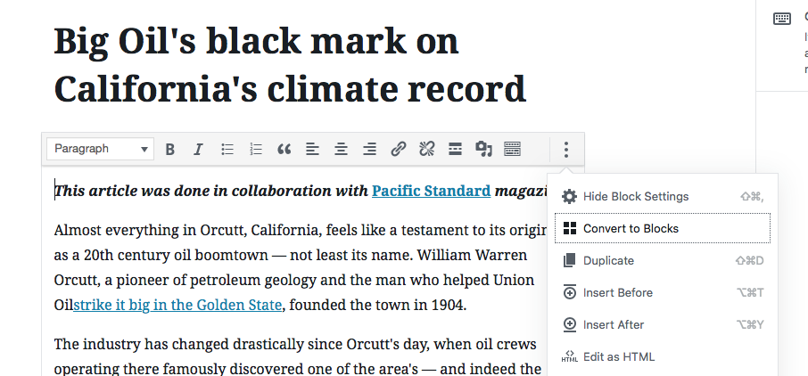
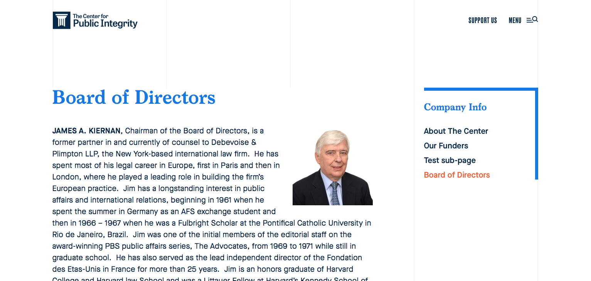

# Introduction

This document serves as a reference for administrating the WordPress CMS backend of the Center for Public Integrity website.

## Useful URLs

| Link                                                                                                                                   | Description                                                                     |
| -------------------------------------------------------------------------------------------------------------------------------------- | ------------------------------------------------------------------------------- |
| [Publicintegrity.org](https://publicintegrity.org) ([Login](https://publicintegrity.org/wp-admin/) )                                   | Live server: the live, public website.                                          |
| [Pantheon Test Site](https://test-public-integrity.pantheonsite.io) ([Login](https://test-public-integrity.pantheonsite.io/wp-admin/)) | Test server: updates when deployment is run via Pantheon                        |
| [Pantheon Dev Site](https://dev-public-integrity.pantheonsite.io) ([Login](https://dev-public-integrity.pantheonsite.io/wp-admin/))    | Dev server: updates automatically when code is merged into the `develop` branch |

**See also:** [How to create an article](https://docs.google.com/document/d/1XOi-pPW4-XNWzr3CHNXAoovEDe9Me16MCi0XXoaDR8Q/edit), a guide (in Google Docs) focused on article creation for those new to the CMS.

# Media Guidelines

## Block Alignments

Many Gutenberg blocks — including images, videos, embeds, and tables — offer a set of alignment buttons. We've implemented layout styles for these selectively as follows:


| Alignment Button     | Meaning                                                                                                                                                                                                                                                                                                                                                                            |
| -------------------- | ---------------------------------------------------------------------------------------------------------------------------------------------------------------------------------------------------------------------------------------------------------------------------------------------------------------------------------------------------------------------------------- |
| `(No Alignment)`     | The default alignment, with none of the buttons selected: images and video break out of the text column into the right margin, with their captions hanging below. Twitter, Facebook, Instagram, and DocCloud embeds are exempted and default to their "natural" width of 500px.                                                                                                    |
| `Align Center`       | Constrains the block to the text column on wide screens. Useful if you don't have a high-resolution image or simply to prevent the image from taking up too much space.                                                                                                                                                                                                            |
| `Align Left & Right` | On wider screens the block is inset (floated) in the text either left or right, taking up 50% of the column. The caption goes below.                                                                                                                                                                                                                                               |
| `Full Width`         | Displays the block edge-to-edge of the browser. Should be reserved for very special cases, and only once or twice in an article. Note that full-width blocks will run over the sidebar content on wide screens. ⚠️ **Note:** for Full Width images, it's best to crop your upload to a wide aspect ration (at least 16:9) to keep the image from getting too tall on wide screens. |

## Preparing Images

Because the CMS handles image sizing, cropping, and optimization (and outputs images scaled for the user's browser), you should feel free to upload large images. For more details, see the table below.

| Field                                | Prep before upload                                                   | Notes                                                                                                                                                                              |
| ------------------------------------ | -------------------------------------------------------------------- | ---------------------------------------------------------------------------------------------------------------------------------------------------------------------------------- |
| Article Featured Image               | Size to ~2500 px wide                                                | This image gets used in many contexts, often cropped to a square or circle. If the **Topper Style** field is set to "Full-Width", the topper uses a 2:1 (very wide) crop.          |
| Article content images               | Size to ~2500 px wide                                                | If your only file size is less than 700 px wide, use **Align Left/Right** or **Align Center**. <br /> Images used with a **Full Width** treatment should be cropped to 16:9. wider |
| Home: Data Point Illustration        | Upload as 900 px square                                              | Cropped to a square/circle on output                                                                                                                                               |
| Home: Impact Images                  | (None)                                                               | Cropped to 350 px wide by 500 px tall on output                                                                                                                                    |
| Home: Spotlight Image                | Convert to grayscale                                                 | Cropped variously on output depending on browser                                                                                                                                   |
| Home: About Us Image                 | Convert to grayscale                                                 | Cropped variously on output depending on browser                                                                                                                                   |
| Home: Partner Logos                  | Size to 600 px by 300 px PNG or SVG, with the logo centered on white | Outputs as uploaded                                                                                                                                                                |
| Authors: Photos                      | Size to 500 px square                                                | Cropped to a square/circle on output                                                                                                                                               |
| Partners: Icons                      | Size to 80 px square PNG                                             | Create the logo as white-on-black circle                                                                                                                                           |
| Site Settings: Support Us Image      | Convert to grayscale                                                 | Cropped variously on output depending on browser                                                                                                                                   |
| Site Settings: Big Newsletter Signup | Convert to grayscale                                                 | Cropped variously on output depending on browser                                                                                                                                   |
| About Page: Intro Image              | (None)                                                               | Cropped to 800px wide by 600 px tall on output                                                                                                                                     |
| Support Page: Support Summary Image  | Convert to grayscale                                                 | Cropped to 800px wide by 600 px tall on output                                                                                                                                     |
| Topics: Main Topic Illustrations     | Size to 900 px square                                                | Cropped to a square on output                                                                                                                                                      |

# Home Page

To edit and curate the content on the home page, click **Pages** in the Wordpress sidebar and then click into the **Home Page** entry. Each primary component gets its own tab here.

⚠️ **Note:** The Newsletter Signup and Support Us modules aren't specific to the home page — their fields are under the [Site Settings](#site-settings) tab in Wordpress.

## Topper


The topper is primarily for CPI "data points" — facts and figures that showcase CPI's relevance and effectiveness in investigative reporting. Use the fields to add your headline text and attach an illustration graphic, sized to ~1200px square. You can also optionally specify a Wordpress page (like About Us or Support): this wraps the headline and graphic in a link and adds a small text link below the dek as well.

Occasionally you may want to use this space to showcase an important article. Change the radio button to Featured Article and find the article in the picker. The templates will pull in the article's title, subtitle, and image, along with a "Read" link.

## Features Carousel


These article teases appear in a horizontal carousel just below the topper with their images cropped to a circle. Choose four to eight articles and drag and drop them to reorder.

## Impact Pieces


This section lets you showcase _results_ from CPI's work, whether recent or not. Size the illustration graphics vertically, to 350px x 500px. This is a repeater field, so you can add and order 1 to 3 items (the templates will alternate the text/image layout automatically).

## Editors’ Roundup


This module appears further down the home page: Select 4 or 6 articles (for balanced columns) to appear in a centered grid. This module is especially useful for resurfacing older articles that have become relevant again.

Remove all roundup articles to disable the entire module.

## Spotlight


The optional spotlight area lets you use a white-on-dark-blue block to showcase a link to an article or a custom URL. Convert your image to grayscale before uploading — the image will be tinted/faded in the background automatically.

Leave the Spotlight Headline blank to disable the entire module.

## Partners


Add your partners text and logos here. Partner logos should be centered on a 600p by 300px artboard.

Remove all the logos to disable the entire module.

## About Us


This "Who We Are" module is useful if the topper is set to feature an article instead of a data point. As with the Spotlight image, convert your image to grayscale before uploading — the image will be tinted/faded in the background automatically.

Leave the About Us Headline blank to disable the entire module.

## Welcome Message


This field is intended only for a short period after launch. Text here will show up at the top of the home page in large type on a beige background.

Leave the field blank to remove the message from the site.

# Articles

## Legacy Articles

Articles imported from the previous version of the site have a few differences than articles you'll be creating from scratch:

First, in order to catch duplicate records and other issues, legacy articles have been given several Wordpress tags automatically:

| Tag               | Meaning                                                                            |
| ----------------- | ---------------------------------------------------------------------------------- |
| `Legacy`          | Applied to every imported article                                                  |
| `Title ok`        | Title is less than 75 characters and article title matches archive view title      |
| `Oversized title` | Title is greater than 75 characters and both scraped titles _may or may not_ match |
| `Content ok`      | Scraped article body is greater than or equal to 1200 characters                   |
| `Needs checking`  | Title less than 75 characters and both scraped titles _don't_ match                |
| `Not an Article`  | Scraped article body is less than 1200 characters                                  |

⚠️ **Note:** While tags in general are not displayed publicly, the article view checks for the `Legacy` tag when building article chapters — if tagged as legacy, chapters are built from `Heading 4`s instead of the usual `Heading 2`s. This means that if you "rebuild" a legacy article with `Heading 2`s and want to retain chaptering, you must remove the `Legacy` tag.



Second, legacy articles use Wordpress’s “Classic Editor,” which is a single WYSIWYG field without Gutenberg's concept of blocks. Wordpress offers a **Convert to Blocks** action in the block menu — this feature works but may produce inconsistent or unexpected results. For instance, pull quotes may be rendered as block quotes and captions will need to be moved back into their associated image block.

## Creating Articles

Gutenberg is Wordpress's new content editing interface: it treats each component of an article — every paragraph, heading, image and caption, etc. — as a discrete block that can be (a) edited with a predefined set of fields and formatting buttons and (b) dragged and dropped up and down in the article's content.

Be sure to check out the keyboard shortcuts (get an overview by typing `^` `⌥` `H`).

As you create and edit blocks, the right-hand inspector pane updates to show additional controls. You can click **Document** to see article-level controls and then back to **Block** to see block-level controls.

## Article Content

### Titles


Choose **Posts › Add New** from the Wordpress sidebar to create a new article. Type or paste your title where you see `Add title`. _Aim for article titles below 75 characters_.

⚠️ **Note:** When you click the **Save Draft** or **Publish** buttons, Wordpress automatically generates a "slug" and permalink URL from your article title. You can review or change this by mousing over the title and clicking the **Edit** button that appears.

### Basic Text


Below the article title is the primary Gutenberg content interface. The _paragraph_ is the default block in Gutenberg, and it contains buttons to bold, italicize, add hyperlinks, etc.

Some tips for base text styles:

-   Links, bold, and italics will be preserved when pasting in from Word or other rich text environments like Google Docs.
-   We've set up pre-built heading styles, so they should be applied consistently. Apply `Heading 2` through `Heading 4` to reflect the document outline; in many cases a few `Heading 2`s will be all that is required.
-   To ensure site-wide consistency, avoid ad-hoc formatting that affects text-alignment, color, or text size.

⚠️ **Note:** The sidebar will automatically include “chapter” jump-links and a progress meter built from your `Heading 2` sub-headings. The exception is legacy articles (imported from the previous site and tagged in Wordpress as `Legacy`) — the jump-links for these are built from `Heading 4`s.

### Images

Insert an image using Gutenberg's image block: you can then upload your image file, add or edit the caption, and then optionally set alignment using the alignment buttons.

Vertical (portrait) images are best set to `Align Left` or `Align Right`.

### Gallery Block


Galleries are useful when you have more than three images and want to create a slideshow overlay with optional captions.

Choose **CPI Gallery** via the block picker, write a caption to describe the gallery as a whole in the caption field, then upload or choose your images. As you're selecting your images via the Media Gallery, you can edit the `caption` field for each image: this is the caption that appears in the slideshow overlay only.

Once published, galleries are automatically displayed as a cluster of the _first three images_ in the gallery (all cropped to a square), followed by the gallery caption and a "Launch Gallery" link. The rest of the images are only displayed in the slideshow overlay. You can have multiple galleries in an article, but it's best for them to be separated by text for visual clarity.

### Related Articles Block


While articles in a series are automatically linked in the left-hand sidebar, you can also add insert a sidebar with links and previews of articles of your choosing, wherever you want in your article. Choose **Related Articles** from the block picker, optionally add Header Text (e.g. “Related Articles”, “More on Campaign Finance”, etc.), and then use the Chosen Articles repeater to add one or more articles. Multiple Related Articles blocks are allowed.

⚠️ Since this component "floats" to the right and lets text wrap around it on wide screens, make sure you place it in a location that has two or three paragraphs below it. Use the article preview to make sure the sidebar doesn't bump up against content further down the page.

### Tables


Gutenberg's table block lets you create and edit HTML tables. You can also paste table markup into the `HTML` block and use **Convert to Blocks** to get a Gutenberg table block. All alignments are available here as well as some other options under the Block inspector: a **Stripes** setting will apply a light color to every other table row (useful for very long tables), while **Fixed width table cells** will enforce equal-width table columns regardless of the amount of content in each cell.

⚠️ Tables with _five columns or more_ will automatically scroll horizontally on mobile. If you wish to invoke this behavior for tables with fewer columns, add `wide` to the Additional CSS Class field in the Advanced section of the Block inspector. Just make sure to keep a space between wide and any other classes that appear here.

### Email Sign-up Block


Articles are also an opportunity to build your email list. You can place the **Email Sign-up** block anywhere in your article. Customize it by adding a headline and body text (samples are available in the help text).

Alignment buttons have no effect.

### Pull Quotes


Create a block and choose the pull quote option: it provides a field for the quote itself as well as for a citation. Alignment buttons have no effect.

⚠️ If your pull quote is literally a quotation, remember to use curly quotation marks a the beginning and end. `“` can be typed on a Mac with `Opt` `[`, while `”` is `Opt` `Shift` `[`. Read more at [smartquotesforsmartpeople.com](http://smartquotesforsmartpeople.com).

Alignment buttons have no effect.

### Block Quotes

Block quotes (not to be confused with Pull Quotes) are useful for displaying text cited from another source — choose the **Quote** Gutenberg block, add your text and an optional citation; the text gets a muted gray treatment with a left-side border.

### Embeds

The Gutenberg editor is generally good about detecting URLs for common services. You can paste the direct URL (not an iframe) for Tweets, Instagram post, Vimeo/Youtube videos, DocCloud, and Soundcloud audio directly into the editor and the UI will embed the media automatically. By default, videos get the same wide treatment that images do, though you can constrain them to the text column with the "Align Center" button.

For services like Highcharts that provide `<iframe>` code, choose the `HTML` block and paste. You can click the Preview tab above the block to be sure the embed is working without leaving the editor.

The Align Left/Right alignment buttons work for common "rich" embed services like Twitter, Facebook, Instagram, and Document Cloud. "Align Center" will cap the width at 500px and center the embed in the text column.

### Station Identification


Insert a new block under **Widgets › Station ID**.

The block always pulls content from the text set under **[Site Settings](#site-settings) › Who We Are**.

### Corrections

We've added a custom (aka "reusable") Gutenberg block useful for creating a linkable anchor in the middle of an article. The block is really just a shortcut for setting up the following format of HTML:

```
<p id="correction-1"><strong>Correction: </strong> Correction text goes here.</p>
```

1. Choose the **Correction** block from the Gutenberg pop-up menu.
2. ⚠️ **Click the kebab menu and choose Convert to Regular Block**. This step disconnects this instance from the block template, so you don't end up editing the global version.
3. If adding more than one correction to the page, increment the number in the id (e.g. `<p id="correction-2">...`).
4. Write your correction or update in the paragraph tags.
5. At the beginning or end of the article, add a paragraph mentioning the update/correction and link to the correction paragraph. A same-page anchor link just needs `#correction-1` or similar in the link destination field.

## Other controls

### Article Topper Style


You can choose one of several styles for article toppers: **Image, Light Background**, **Image, Dark Background**, **Image, Full Width**, and **No Image, Light Background** . The first three require a Featured Image attachment with both sides greater than 600px — without one, this field is ignored and the No Image layout will be applied. Sizing and cropping is automatic, so _we recommend uploading images around 3000px wide._

The **Image, Full Width** style should be reserved for high-investment articles with a striking featured image, and your image file should be at least 2000px wide. This treatment overlays the type on a semi-transparent blue-black gradient and auto-crops the image to a square on mobile and a (very wide) `2:1` ratio on desktop.

You can also optionally turn off the **Topper tucked under logo?** switch in the rare case you don't want the site header overlaid on CPI logo.

### Partnership Description

Use this field to summarize partnerships with other publications, (`This story was co-published with the Daily Beast.`). You can include light formatting like links, and the description will appear above the article body.

### Article Partners


In addition to the above description, you can also add a partner icon to appear in certain article teases. Frequent partners (like AP and NPR) and their icons are stored in **Posts › Partners** and can be updated over time. Once these are created, you can select them under Article Partners (in the Partnership field group). As a rule, collaborations with partners should be assigned the CPI icon as well as the partner icon.

### Subtitle

This field outputs as a mid-sized dek below the article topper; this text also gets used when an article is shared to Facebook and in. Shoot for ~120 characters or fewer.

### Published & Updated Dates

Every article shows a **Published** date controlled by Wordpress's native Published field (under Status & Visibility in the post's sidebar). This is automatically set to the current date and time when the article is first published, which you can manually override. If you set it to a date/time in the future, the article will go live at that time.

Below the post content is the **Updated** custom field, which provides a second date-and-time picker. This field is completely under your control — you can choose to set it or leave it blank when editing a previously-published post. If set, it outputs the date and time next to an "Updated" label, to the right of the Published date. If the Updated _day_ matches the Published day, only the time outputs.

### More Stories Links

Used for legacy articles only.

### Microsites

Articles have a button which can be checked to indicate that it's a **Microsite**. For legacy microsites imported before October 30th, 2018, they should already have correct redirect URLs, which can be found in the **Legacy URL** ACF field. If there is an issue with the URL from that field or a microsite is being added _after_ the aforementioned import, the redirect URL for the microsite should be put into the **Microsite URL** ACF field. Please note that if both URL fields have valid URLs, the **Microsite URL** field will take priority.

### Post Authors

When publishing an article, use the autocomplete-as-you-type **Author(s)** field near the bottom of the page under the Post Authors heading. If you add more than one author, you can re-order them by dragging and dropping — this order will be respected on output.

# Authors

Visit **Posts › Authors** to view and edit the full list of article authors. (For flexibility, authors are managed independently of Wordpress user accounts). Click into an author to edit his or her name, job title, organization, biography, photo, Twitter URL, and PGP key. "Organization" should be left empty for CPI staff. Pasting in a PGP key will create a link that lets users copy the string of text to their clipboard.

Finally, you can optionally feature a few articles to which the author has been assigned. These appear under a Feature heading in a large tease format above the standard (automated) reverse-chronological, paginated archive for that author.

You can also link an author to an entry from the partner organization taxonomy (NPR, the AP, etc). Doing so adds the partner organization's icon as a badge on the author's photo (article view only).

# Topics

Topic pages and their associated archive of articles are automatically generated from the list under **Posts › Categories**. This taxonomy provides a two-level hierarchy, with primary topics getting an illustration at the top, an email sign-up partway down, and a full sub-topic director at the bottom.

The Wordpress category tools let change Topic names, change a Sub-Topic to a topic, etc. and the change will be reflected everywhere on the site. Deleting a topic here removes it from any articles to which it has been assigned.

To add a topic or sub-topic to the navigation overlay, use the [Nav Topics menu](/#navigation-menus-navigation-overlay-navigation-topics).

Note: Be sure to select the **Category Type** manually: every parent topic should be set to `Main Topic`, and every child topic should be set to `Sub-Topic`, or, in the case of Immigration Decoded sub-topic, `Blog`. This setting will ensure you see the correct fields for the template that gets used.

## Featured Articles and Series

By default, the public pages created by these topic and sub-topic settings create a reverse-chron archive for articles assigned to them. But you can customized these pages in additional ways:

1. Main topics allow you to "pin" a few articles above the reverse-chronological list of articles. Use these for high-investment pieces.

2. Sub-Topics can optionally contain a Series: select the articles in the series via the Featured Posts picker. **Series constructed here automatically output "Part 1 of 3", etc. in their toppers** You can also optionally override the labels (headings) that appear on the landing page. For example, you could change the default "Featured" text to "Our three-part series" and "Latest" to "Further Coverage".

⚠️ **Note 1:** While the site accommodates “sub-sub-topics” (topics nested at the third level), a Series sub-topic must always be at the “bottom” of its hierarchy to display its article teases correctly.

⚠️ **Note 2:** Series language ("Part x of y") is only applied when a series has _more than one_ article in it.

# Comments

Comments on articles can be managed in Wordpress: click the **Comments** tab to view, delete, and moderate incoming comments. Further administrative controls live under **Comments › Settings**. Note that the Styling section interacts with base styles we have applied, so it's best not to change anything under this tab.

# Navigation Menus

You can control the pages and topics that appear in the navigation overlay. In Wordpress, visit **Appearance › Menus**. By default you'll be viewing one of the three "menus" that control the navigation contents: _Masthead Links_, _Nav Pages_ or _Nav Topics_. Use the pop-menu to toggle between them. While the UI here will let you put any kind of link (page, topic, post, custom URL, etc.) into either menu, it's best to stick to these guidelines:

## Masthead Link

Choose **one and only one** page to add to the masthead next to the Menu button (wide screens only). This will probably be the Support Us page, and should be repeated in Navigation Pages so it is available to mobile users. Note that you can use the item dropdown to give the link a custom label (e.g. _Support Our Work_ instead of just _Support Us_).

## Navigation Overlay

### Navigation Pages

-   Add links to pages like About, Privacy Policy, and Support Us. These appear in a horizontal row at the top of the navigation overlay.
-   Don't use the nesting feature — nested items won't show up.

### Navigation Topics

-   You can choose _which_ topics to feature here and in what order, and it's fine if that's just a subset of the full topic list.
-   Use the nesting feature to preserve the hierarchy of topic and subtopics: once you have your featured topics added to the Menu Structure pane, drag the subtopics a little to the right, under their parent. These will then output as sub-items in the navigation overlay on the website.

# Pages

## Basic Pages

To create a free-standing page like "Privacy Policy", choose **Pages › Add New** in Wordpress. Give the page a title and fill out the content via the Gutenberg editor — styles will be applied that match article styles. You can then optionally add this page to the Pages section of the [navigation menu](#navigation-menus-navigation-overlay-navigation-pages).



Basic pages can also be nested one level: when creating the page, look under the Document inspector and choose a parent from the **Parent Page** pop-up menu. Nested pages automatically add a sidebar containing navigation links to the (the sidebar outputs the section's same list of links on both the landing- and sub-pages). To change the sidebar heading from the default "In this section" text, use the Sidebar Heading field located in the parent page.

## Special Pages

The About Us (landing) page and Support Us pages use custom fields and templates to manage their content. Once published, don't alter the **Template** or **Parent Page** settings in the Document inspector. The About Us page can accommodate child pages via the parent-child relationship described above. The Support page cannot.

The support page gives you control over the membership form that sends the user to members.publicintegrity.org, as well as all the text on the page as well. The fields are grouped under the tabs **Page Topper**, **Membership Form**, and **Page Content**. The Membership Form fields lets you set the default dollar value in the input and sort/disable any of the installment options.

# Site Footer

Edit the global footer content in [**Site Settings**](#site-settings): you can select pages to appear in the list of linked pages, set the Support page, and edit the mission statement.

# Site Settings

Certain fields control content in modules that may appear in several parts of the site (e.g. the Newsletter sign-up module). In Wordpress, click **Site Settings** in the sidebar to view and edit this content.

# RSS Feeds

With the current URL structure, RSS Feeds can be accessed but tacking `/feed` to the end of the URL (i.e.`https://publicintegrity.org/topics/environment/feed`). Additional explanation and examples can be found in the following [WordPress documentation](#https://codex.wordpress.org/WordPress_Feeds).

# Redirects

To create and manage redirects, go to `Tools -> Safe Redirect Manager` in the WordPress admin. Here you can create redirects i.e. from `/old-url` to `/new-url`.

# Google Optimize Tests

[Google Optimize](https://optimize.google.com) allows for testing different versions of pages to see which one performs better based on a user specified event i.e. a button being clicked or a page being visited.

1. Create two pieces of content in WordPress.
2. Be sure to check `Enable this page to be tested using Google Optimize` at the bottom of the page.
3. In Google Optimize create a new experience of type "Redirect test", and follow the instructions.
